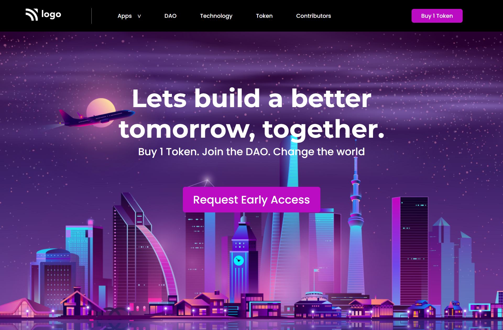

# UI Project 05 - Web 3 DAO Homepage

> ### **Deployed Website** :-[Live Link](https://ui-project-5.netlify.app/)
 

## Project key takeaways:

  - Used Only **Html** and **CSS**
  - I learned a lot about flexbox and position combined.
  - I learned a lot about background images, their position and orientation.

   

 

> ## It took around 3 hours to complete and make this project **Mobile** Responsive.
